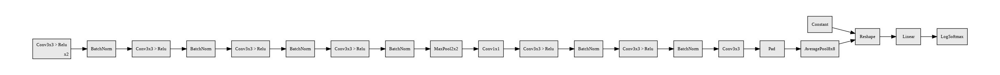
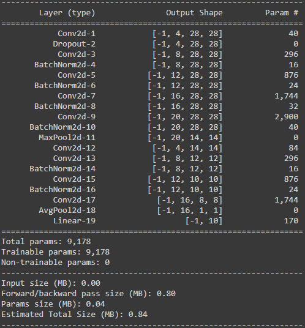
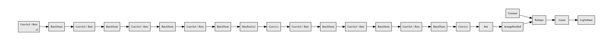
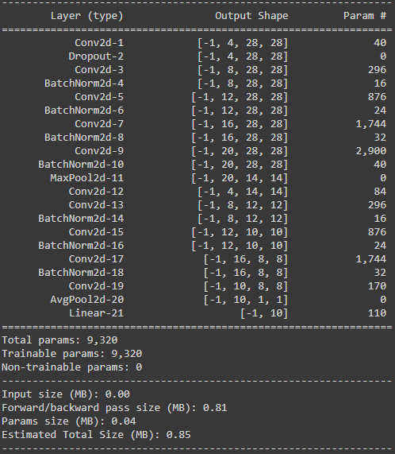
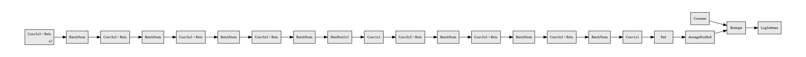
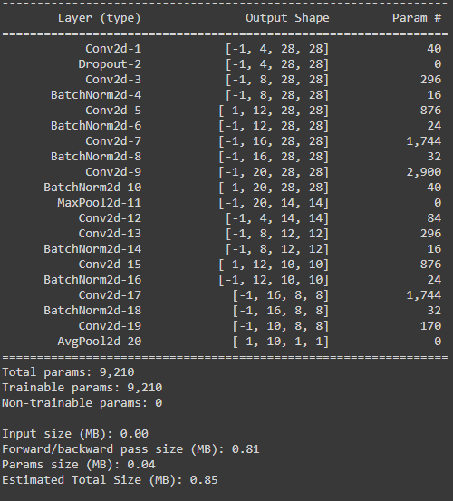
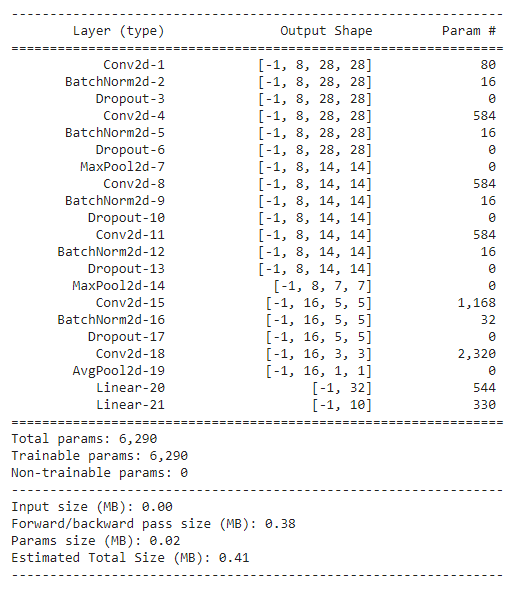
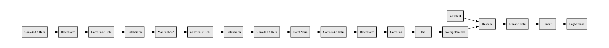
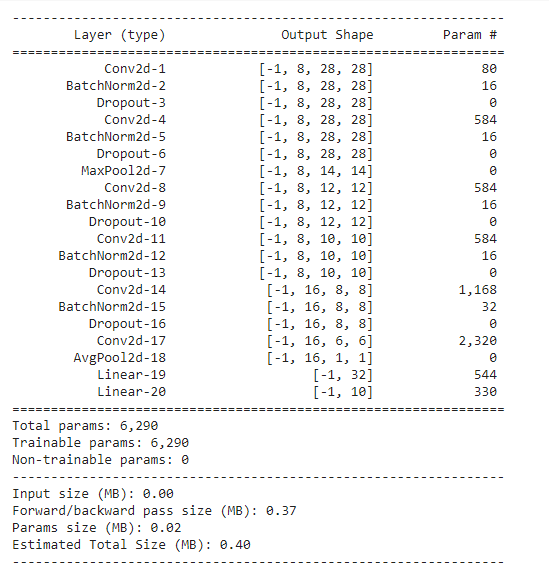

# Comprehensive Study on Training Neural Nets to Acheive 99.4%+ Accuracy on Number Recognition(MNIST)

## Goal To achieve

The activity that was performed using MNIST data was to achieve a validation accuracy of atleast **99.4%** within **20 epochs** of training the model and ensuring the number of **parameters are less than 20,000**. The purpose of this activity was to understand how we can consider different types of network architectures, considering different loss functions can help us achieve the desired result.

### Terminology:
**Accuracy**: Just like the score we get after our exam, Accuracy is the score of our Model. It's simply how many correct answers our model gave by total number of questions. Here, we are trying to get an Accuracy(score) of **99.4%**, so when our Model gets 10,000 questions(images), we want our model to answer atleast 9,940 questions(images) correctly.

*Note: The term Validation Accuracy, is nothing but we want our model to predict the number on the image from the unseen data. We gave 60,000 Images to our model, to learn from those, and we check how it's learning by seeing the Training Accuracy, but having high percentage in Training Accuracy doesn't mean that it will perform good when given unseen data, becuase it may have rememberd all the 60,000 Images and may be good only on those 60,000 Images.  
So, to avoid that, we keep 10,000 Images separately and doesn't show the model those images until it's time to test. So we want better Validation Accuracy and the goal is to acheive 99.4% Validation accuracy rather than Trainig Accuracy.*

**epochs**: When the model goes through the entire dataset once, it is called 1 epoch. The model to learn better, we have to show the model the images multiple times. Here, we are trying to acheive our goal under 20 epochs, so the model gets to see all the 60,000 images 19 times.

**Parameters**: These are the most important part of our model, indeed these are itself the model. Our model is made up of these parameters. The parameters are numbers which get multiplied with the Image and gives an output. When we train our model, all we are doing is identifying this parameters values, such that when the image is multiplied with this values, the final result is the label of the image.

## Implementation - link to Colab notebooks

View the notebooks:

1. [Multiple Model - Notebook 1](https://colab.research.google.com/drive/14hxzm69jwB4IJEs5CJsVQteCtp7BtqJ7?usp=sharing) - Trained 48 Models
2. [Multiple Model - Notebook 2](https://colab.research.google.com/drive/1Od4xQPigRzRkHGjwTnoJHhlp4BTCZ65q?usp=sharing) - Trained 12 Models 
3. [Final Notebook](https://colab.research.google.com/drive/1fHDkcUkhyXATQ48k6vQrXqT2e2-fQ28N?usp=sharing) - The Best Model out of 60!

Below we have explained in detail on how we achieved the goal and what was our findings.

## Network Architectures Used

To test out what was the best approach, we used 6 different network architectures. The architecture diagram along with the model summary are listed below:

### Network - Vanilla

Vanilla Network: **Architecture Diagram**

In the Vanilla architecture, we have a base structure which involves the convolution layers followed by batch normalization involving padding of 1. Once the receptive field reaches 11, we add a maxpool layer and add a transition block. This is followed by 3 more convolution and batch normalization blocks without any paddings on the convolution blocks. Once the number of pixels in each channel reaches 8x8, we add a GAP layer to reduce it to a 1D consolidated kernel. This is followed by a Linear layer leading towards a log softmax output.

The detailed number of parameters that are being used in the Network are listed below.

Vanilla Network: **Model parameters**

### Network - With Dropout

Network With Dropout: **Architecture Diagram**

In the network architecture, most of the structure is similar to the Vanilla network architecture. The difference between the two network is that, after the first layer, instead of having a batch normalization, we used a dropout. The reason why dropout was used here is that, the number of pixels is pretty high and the information is spread out. Loosing few pixels from the input data acts in some format like a data augmentation strategy.

The detailed number of parameters that are being used in the Network are listed below.

Network With Dropout: **Model parameters**

### Network - With GAP and Transition Layer

Network With GAP and Transition Layer: **Architecture Diagram**

In the network architecture, most of the structure is similar to the network with dropout architecture. We also added a transition block after the last convolution layer to reduce the usage on a fully connected layer.

The detailed number of parameters that are being used in the Network are listed below.

Network With GAP and Transition Layer: **Model parameters**

### Network - With GAP and Transition Layer without FC

Network GAP and Transition Layer without FC: **Architecture Diagram**

In the network architecture, most of the structure is similar to the network with GAP and transition layer architecture. We removed the fully connected layer to try how a fully convolutional layer would behave.

The detailed number of parameters that are being used in the Network are listed below.

Network GAP and Transition Layer without FC: **Model parameters**

### Reduced Parameter Network - With 2 MaxPools + BatchNorm + GAP + Fully Connected (+DropOut)

The Structure uses less parameters, by reducing the number of kernels, to 8 Kernels for all layers, and 16 Kernels for last layer. The model now has 2 Max Pool layers, reducing size from 28x28 to 14x14 and from 14x14 to 7x7 preeced/followed by atleast 2 convolutions layers.  
A Global Average Pooling is introduced to convert 3x3 to 1x1, and is followed bya full connected classifier to predict the final output.

Another variant of this model was using Drop out of 3-5% after each convolutional layer to create regularization and reduce overfitting.

### Reduced Parameter Network - With 1 MaxPools + BatchNorm + GAP + Fully Connected (+DropOut)

The Structure uses less parameters and same as above. But the model now has only 1 Max Pool layers, reducing size from 28x28 to 14x14 followed by a series of convolutions layers, bring size from 14x14 to 6x6 using 4 convolution layers.  
A Global Average Pooling is introduced to convert 6x6 to 1x1, and is followed bya full connected classifier to predict the final output.

The 2 Max Pool was reduced to 1 Max Pool, so that the GAP is applied on a relatively bigger channel size of 6x6 rather than a 3x3.

Another variant of this model was using Drop out of 3-5% after each convolutional layer to create regularization and reduce overfitting.

## Training the models

### Vanilla Network

Trained with 2 different batch size, 3 different types of learning rates, 2 different data augmentation.

|Model Name|No. of Parameters|Learning Rate Scheduler|Data Augmentation|Batch Size|Training Accuracy|Test Accuracy|
|----------|-----------------|-----------------------|-----------------|----------|-----------------|-------------|
|Batch Norm + FC + GAP|9186|None|None|64|99.34|99.08|
|Batch Norm + FC + GAP|9186|StepLR|None|64|99.65|99.27|
|Batch Norm + FC + GAP|9186|ReduceLROnPlateau|None|64|99.24|99.12|
|Batch Norm + FC + GAP|9186|None|Rotation + Affine + Color Jitter|64|98.39|99.35|
|Batch Norm + FC + GAP|9186|StepLR|Rotation + Affine + Color Jitter|64|98.52|99.37|
|Batch Norm + FC + GAP|9186|ReduceLROnPlateau|Rotation + Affine + Color Jitter|64|98.52|99.33|
|Batch Norm + FC + GAP|9186|None|None|128|99.37|99.05|
|Batch Norm + FC + GAP|9186|StepLR|None|128|99.54|99.2|
|Batch Norm + FC + GAP|9186|ReduceLROnPlateau|None|128|99.35|99.12|
|Batch Norm + FC + GAP|9186|None|Rotation + Affine + Color Jitter|128|98.22|99.19|
|Batch Norm + FC + GAP|9186|StepLR|Rotation + Affine + Color Jitter|128|98.41|99.37|
|Batch Norm + FC + GAP|9186|ReduceLROnPlateau|Rotation + Affine + Color Jitter|128|98.41|99.3|

### Network with dropout

Trained with 2 different batch size, 3 different types of learning rates, 2 different data augmentation.

|Model Name|No. of Parameters|Learning Rate Scheduler|Data Augmentation|Batch Size|Training Accuracy|Test Accuracy|
|----------|-----------------|-----------------------|-----------------|----------|-----------------|-------------|
|Batch Norm + FC + Dropout + GAP|9178|None|None|64|99.11|99.14|
|Batch Norm + FC + Dropout + GAP|9178|StepLR|None|64|99.45|99.18|
|Batch Norm + FC + Dropout + GAP|9178|ReduceLROnPlateau|None|64|99.1|99.3|
|Batch Norm + FC + Dropout + GAP|9178|None|Rotation + Affine + Color Jitter|64|98.13|99.27|
|Batch Norm + FC + Dropout + GAP|9178|StepLR|Rotation + Affine + Color Jitter|64|98.62|**99.44**|
|Batch Norm + FC + Dropout + GAP|9178|ReduceLROnPlateau|Rotation + Affine + Color Jitter|64|98.37|99.29|
|Batch Norm + FC + Dropout + GAP|9178|None|None|128|99.2|99.16|
|Batch Norm + FC + Dropout + GAP|9178|StepLR|None|128|99.2|99.14|
|Batch Norm + FC + Dropout + GAP|9178|ReduceLROnPlateau|None|128|99.15|99.16|
|Batch Norm + FC + Dropout + GAP|9178|None|Rotation + Affine + Color Jitter|128|98.36|99.27|
|Batch Norm + FC + Dropout + GAP|9178|StepLR|Rotation + Affine + Color Jitter|128|98.49|99.35|
|Batch Norm + FC + Dropout + GAP|9178|ReduceLROnPlateau|Rotation + Affine + Color Jitter|128|98.05|99.31|

### Network with GAP and transition layer + FC

Trained with 2 different batch size, 3 different types of learning rates, 2 different data augmentation.

|Model Name|No. of Parameters|Learning Rate Scheduler|Data Augmentation|Batch Size|Training Accuracy|Test Accuracy|
|----------|-----------------|-----------------------|-----------------|----------|-----------------|-------------|
|Batch Norm + FC + Transition + GAP|9320|None|None|64|99.17|99.28|
|Batch Norm + FC + Transition + GAP|9320|StepLR|None|64|99.47|99.3|
|Batch Norm + FC + Transition + GAP|9320|ReduceLROnPlateau|None|64|99.37|**99.43**|
|Batch Norm + FC + Transition + GAP|9320|None|Rotation + Affine + Color Jitter|64|98.46|99.32|
|Batch Norm + FC + Transition + GAP|9320|StepLR|Rotation + Affine + Color Jitter|64|98.75|**99.48**|
|Batch Norm + FC + Transition + GAP|9320|ReduceLROnPlateau|Rotation + Affine + Color Jitter|64|98.35|99.35|
|Batch Norm + FC + Transition + GAP|9320|None|None|128|99.28|99.25|
|Batch Norm + FC + Transition + GAP|9320|StepLR|None|128|99.27|99.27|
|Batch Norm + FC + Transition + GAP|9320|ReduceLROnPlateau|None|128|99.22|99.3|
|Batch Norm + FC + Transition + GAP|9320|None|Rotation + Affine + Color Jitter|128|98.39|99.23|
|Batch Norm + FC + Transition + GAP|9320|StepLR|Rotation + Affine + Color Jitter|128|98.69|99.36|
|Batch Norm + FC + Transition + GAP|9320|ReduceLROnPlateau|Rotation + Affine + Color Jitter|128|98.14|99.14|

### Network with GAP and transition layer without FC

Trained with 2 different batch size, 3 different types of learning rates, 2 different data augmentation.

|Model Name|No. of Parameters|Learning Rate Scheduler|Data Augmentation|Batch Size|Training Accuracy|Test Accuracy|
|----------|-----------------|-----------------------|-----------------|----------|-----------------|-------------|
|Batch Norm + Transition + GAP|9210|None|None|64|99.28|99.34|
|Batch Norm + Transition + GAP|9210|StepLR|None|64|99.51|99.35|
|Batch Norm + Transition + GAP|9210|ReduceLROnPlateau|None|64|99.34|99.26|
|Batch Norm + Transition + GAP|9210|None|Rotation + Affine + Color Jitter|64|98.31|99.39|
|Batch Norm + Transition + GAP|9210|StepLR|Rotation + Affine + Color Jitter|64|98.67|**99.54**|
|Batch Norm + Transition + GAP|9210|ReduceLROnPlateau|Rotation + Affine + Color Jitter|64|98.41|99.32|
|Batch Norm + Transition + GAP|9210|None|None|128|99.3|99.28|
|Batch Norm + Transition + GAP|9210|StepLR|None|128|99.48|99.35|
|Batch Norm + Transition + GAP|9210|ReduceLROnPlateau|None|128|99.23|99.24|
|Batch Norm + Transition + GAP|9210|None|Rotation + Affine + Color Jitter|128|98.21|99.24|
|Batch Norm + Transition + GAP|9210|StepLR|Rotation + Affine + Color Jitter|128|98.57|99.36|
|Batch Norm + Transition + GAP|9210|ReduceLROnPlateau|Rotation + Affine + Color Jitter|128|98.42|99.36|

### Network with GAP and transition layer - (2 Max Pools & GAP at 3x3)

Trained with 2 different LR schedulers and no LR scheduler along with different Data Augmentations.

|Model Name| No. Parameters| Scheduler| Data Aug|Batch Size|Train Accuracy| Test Accuracy| 
|:--------:|:-------------:|:--------:|:-------:|:--------:|:------------:|:------------:|
|Batch Norm + GAP + FC|6,290|N/A|Normalize|64|99.53|99.14|    
|Batch Norm + GAP + FC + DropOut|6,290|N/A|Normalize|64|99.195|99.28|
|------|------|------|------|------|------|
|Batch Norm + GAP + FC|6,290|N/A|Normalize + RandomRotate |64|99.105|**99.4**|
|Batch Norm + GAP + FC + DropOut|6,290|N/A|Normalize + RandomRotate|64|98.76|99.36| 
|------|------|------|------|------|------|
|Batch Norm + GAP + FC|6,290|StepLR|Normalize + RandomRotate|64|99.26|99.35|
|Batch Norm + GAP + FC + DropOut|6,290|StepLR|Normalize + RandomRotate|64|98.89|99.24
|------|------|------|------|------|------|
|Batch Norm + GAP + FC|6,290|ReduceLROnPlateau|Normalize + RandomRotate|64|99.28|99.37|
|Batch Norm + GAP + FC + DropOut|6,290|ReduceLROnPlateau|Normalize + RandomRotate|64|99.975|**99.42**|

### Network with GAP and transition layer - (1 Max Pools & GAP at 6x6)
|Model Name| No. Parameters| Scheduler| Data Aug|Batch Size|Train Accuracy| Test Accuracy |
|:--------:|:-------------:|:--------:|:-------:|:--------:|:------------:|:------------:|
|One MP + Batch Norm + GAP + FC|6,290|StepLR|Normalize + RandomRotate|64|99.12|**99.4**|
|One MP + Batch Norm + GAP + FC + DropOut|6,290|StepLR|Normalize + RandomRotate|64|98.9|**99.4**|
|------|------|------|------|------|------|
|One MP + Batch Norm + GAP + FC|6,290|ReduceLROnPlateau|Normalize + RandomRotate|64|99.23|**99.47**|
|One MP + Batch Norm + GAP + FC + DropOut|6,290|ReduceLROnPlateau|Normalize + RandomRotate|64|98.96|99.36|

## Results observed

We tried with 6 different architectures to train 60 different models. We observed the best result of 99.57% validation accuracy when we trained the model with batch size of 64, along with StepLR and Data Augmentation of Rotation, Affine Transformation and Color Jitter and considered Batch Normalization, GAP, Dropout, Transition and a Fully Connected Layer. The following are the reasons why we think that we achieved the best accuracy using this network:

1. With 64 batch size, the number of back propagations that are executed is high. This helps the model learn faster. 
2. With Data Augmentation, it helps in improving the data diversity.
3. With using a Learning Scheduler like Step Learning Rate and Reduce Learning Rate on Plateau, it helps in reaching the global minima rather than skipping over the global minima.

We were successful in achieving a validation accuracy greater than 99.4 with network including Fully Connected layer. These were achieved with training networks having batch size of 64. We observed that, whenever we used data augmentation or some kind of Learning Rate schedulers, we achieved the target. So the importance goes towards understanding how using Learning Rate Scheduler and data augmentation affects the training a model. Hence the next steps we want to focus towards is to discover how these hyper parameters affect training a model.
 
