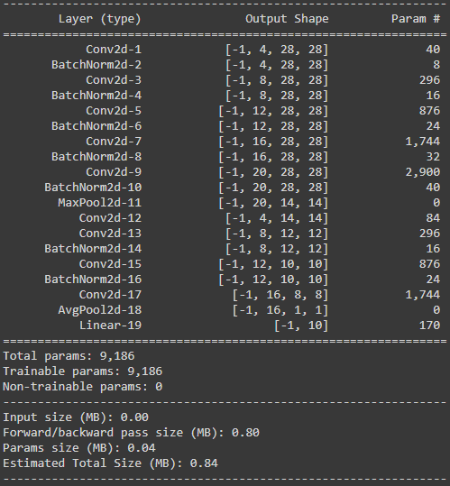

# Train models on MNIST Dataset to achieve 99.4 validation accuracy

## Goal To achieve

The activity that was performed using MNIST data was to achieve a validation accuracy of atleast 99.4% within 20 epochs of training the model and ensuring the number of parameters are less than 20,000. The purpose of this activity was to understand how we can consider different types of network architectures, considering different loss functions can help us achieve the desired result.

Below we have explained in detail on how we achieved the goal and what was our findings as much detailed possible for us.

## Network Architectures Used

To test out what was the best approach, we used 6 different network architectures. The architecture diagram along with the model summary are listed below:

### Network - Vanilla

Vanilla Network: **Architecture Diagram**

In the Vanilla architecture, we have a base structure which involves the convolution layers followed by batch normalization involving padding of 1. Once the receptive field reaches 11, we add a maxpool layer and add a transition block. This is followed by 3 more convolution and batch normalization blocks without any paddings on the convolution blocks. Once the number of pixels in each channel reaches 8x8, we add a GAP layer to reduce it to a 1D consolidated kernel. This is followed by a Linear layer leading towards a log softmax output.

The detailed number of parameters that are being used in the Network are listed below.

Vanilla Network: **Model parameters**

### Network - With Dropout

Network With Dropout: **Architecture Diagram**

In the network architecture, most of the structure is similar to the Vanilla network architecture. The difference between the two network is that, after the first layer, instead of having a batch normalization, we used a dropout. The reason why dropout was used here is that, the number of pixels is pretty high and the information is spread out. Loosing few pixels from the input data acts in some format like a data augmentation strategy.

The detailed number of parameters that are being used in the Network are listed below.

Network With Dropout: **Model parameters**

### Network - With GAP and Transition Layer

Network With GAP and Transition Layer: **Architecture Diagram**

In the network architecture, most of the structure is similar to the network with dropout architecture. We also added a transition block after the last convolution layer to reduce the usage on a fully connected layer.

The detailed number of parameters that are being used in the Network are listed below.

Network With GAP and Transition Layer: **Model parameters**

### Network - With GAP and Transition Layer without FC

Network GAP and Transition Layer without FC: **Architecture Diagram**

In the network architecture, most of the structure is similar to the network with GAP and transition layer architecture. We removed the fully connected layer to try how a fully convolutional layer would behave.

The detailed number of parameters that are being used in the Network are listed below.

Network GAP and Transition Layer without FC: **Model parameters**

## Training the models

### Vanilla Network
Trained with 2 different batch size, 3 different types of learning rates, 2 different data augmentation.

|Model Name|No. of Parameters|Learning Rate Scheduler|Data Augmentation|Batch Size|Training Accuracy|Test Accuracy|
|----------|-----------------|-----------------------|-----------------|----------|-----------------|-------------|
|Batch Norm + FC + GAP|9186|None|None|64|99.34|99.08|
|Batch Norm + FC + GAP|9186|StepLR|None|64|99.65|99.27|
|Batch Norm + FC + GAP|9186|ReduceLROnPlateau|None|64|99.24|99.12|
|Batch Norm + FC + GAP|9186|None|Rotation + Affine + Color Jitter|64|98.39|99.35|
|Batch Norm + FC + GAP|9186|StepLR|Rotation + Affine + Color Jitter|64|98.52|99.37|
|Batch Norm + FC + GAP|9186|ReduceLROnPlateau|Rotation + Affine + Color Jitter|64|98.52|99.33|
|Batch Norm + FC + GAP|9186|None|None|128|99.37|99.05|
|Batch Norm + FC + GAP|9186|StepLR|None|128|99.54|99.2|
|Batch Norm + FC + GAP|9186|ReduceLROnPlateau|None|128|99.35|99.12|
|Batch Norm + FC + GAP|9186|None|Rotation + Affine + Color Jitter|128|98.22|99.19|
|Batch Norm + FC + GAP|9186|StepLR|Rotation + Affine + Color Jitter|128|98.41|99.37|
|Batch Norm + FC + GAP|9186|ReduceLROnPlateau|Rotation + Affine + Color Jitter|128|98.41|99.3|

### Network with dropout 
Trained with 2 different batch size, 3 different types of learning rates, 2 different data augmentation.

|Model Name|No. of Parameters|Learning Rate Scheduler|Data Augmentation|Batch Size|Training Accuracy|Test Accuracy|
|----------|-----------------|-----------------------|-----------------|----------|-----------------|-------------|
|Batch Norm + FC + Dropout + GAP|9178|None|None|64|99.11|99.14|
|Batch Norm + FC + Dropout + GAP|9178|StepLR|None|64|99.45|99.18|
|Batch Norm + FC + Dropout + GAP|9178|ReduceLROnPlateau|None|64|99.1|99.3|
|Batch Norm + FC + Dropout + GAP|9178|None|Rotation + Affine + Color Jitter|64|98.13|99.27|
|Batch Norm + FC + Dropout + GAP|9178|StepLR|Rotation + Affine + Color Jitter|64|98.62|**99.44**|
|Batch Norm + FC + Dropout + GAP|9178|ReduceLROnPlateau|Rotation + Affine + Color Jitter|64|98.37|99.29|
|Batch Norm + FC + Dropout + GAP|9178|None|None|128|99.2|99.16|
|Batch Norm + FC + Dropout + GAP|9178|StepLR|None|128|99.2|99.14|
|Batch Norm + FC + Dropout + GAP|9178|ReduceLROnPlateau|None|128|99.15|99.16|
|Batch Norm + FC + Dropout + GAP|9178|None|Rotation + Affine + Color Jitter|128|98.36|99.27|
|Batch Norm + FC + Dropout + GAP|9178|StepLR|Rotation + Affine + Color Jitter|128|98.49|99.35|
|Batch Norm + FC + Dropout + GAP|9178|ReduceLROnPlateau|Rotation + Affine + Color Jitter|128|98.05|99.31|

### Network with GAP and transition layer + FC 
Trained with 2 different batch size, 3 different types of learning rates, 2 different data augmentation.

|Model Name|No. of Parameters|Learning Rate Scheduler|Data Augmentation|Batch Size|Training Accuracy|Test Accuracy|
|----------|-----------------|-----------------------|-----------------|----------|-----------------|-------------|
|Batch Norm + FC + Transition + GAP|9320|None|None|64|99.17|99.28|
|Batch Norm + FC + Transition + GAP|9320|StepLR|None|64|99.47|99.3|
|Batch Norm + FC + Transition + GAP|9320|ReduceLROnPlateau|None|64|99.37|99.43|
|Batch Norm + FC + Transition + GAP|9320|None|Rotation + Affine + Color Jitter|64|98.46|99.32|
|Batch Norm + FC + Transition + GAP|9320|StepLR|Rotation + Affine + Color Jitter|64|98.75|**99.48**|
|Batch Norm + FC + Transition + GAP|9320|ReduceLROnPlateau|Rotation + Affine + Color Jitter|64|98.35|99.35|
|Batch Norm + FC + Transition + GAP|9320|None|None|128|99.28|99.25|
|Batch Norm + FC + Transition + GAP|9320|StepLR|None|128|99.27|99.27|
|Batch Norm + FC + Transition + GAP|9320|ReduceLROnPlateau|None|128|99.22|99.3|
|Batch Norm + FC + Transition + GAP|9320|None|Rotation + Affine + Color Jitter|128|98.39|99.23|
|Batch Norm + FC + Transition + GAP|9320|StepLR|Rotation + Affine + Color Jitter|128|98.69|99.36|
|Batch Norm + FC + Transition + GAP|9320|ReduceLROnPlateau|Rotation + Affine + Color Jitter|128|98.14|99.14|

### Network with GAP and transition layer without FC
Trained with 2 different batch size, 3 different types of learning rates, 2 different data augmentation.

|Model Name|No. of Parameters|Learning Rate Scheduler|Data Augmentation|Batch Size|Training Accuracy|Test Accuracy|
|----------|-----------------|-----------------------|-----------------|----------|-----------------|-------------|
|Batch Norm + Transition + GAP|9210|None|None|64|99.28|99.34|
|Batch Norm + Transition + GAP|9210|StepLR|None|64|99.51|99.35|
|Batch Norm + Transition + GAP|9210|ReduceLROnPlateau|None|64|99.34|99.26|
|Batch Norm + Transition + GAP|9210|None|Rotation + Affine + Color Jitter|64|98.31|99.39|
|Batch Norm + Transition + GAP|9210|StepLR|Rotation + Affine + Color Jitter|64|98.67|**99.54**|
|Batch Norm + Transition + GAP|9210|ReduceLROnPlateau|Rotation + Affine + Color Jitter|64|98.41|99.32|
|Batch Norm + Transition + GAP|9210|None|None|128|99.3|99.28|
|Batch Norm + Transition + GAP|9210|StepLR|None|128|99.48|99.35|
|Batch Norm + Transition + GAP|9210|ReduceLROnPlateau|None|128|99.23|99.24|
|Batch Norm + Transition + GAP|9210|None|Rotation + Affine + Color Jitter|128|98.21|99.24|
|Batch Norm + Transition + GAP|9210|StepLR|Rotation + Affine + Color Jitter|128|98.57|99.36|
|Batch Norm + Transition + GAP|9210|ReduceLROnPlateau|Rotation + Affine + Color Jitter|128|98.42|99.36|

## Results observed

## Our Findings
