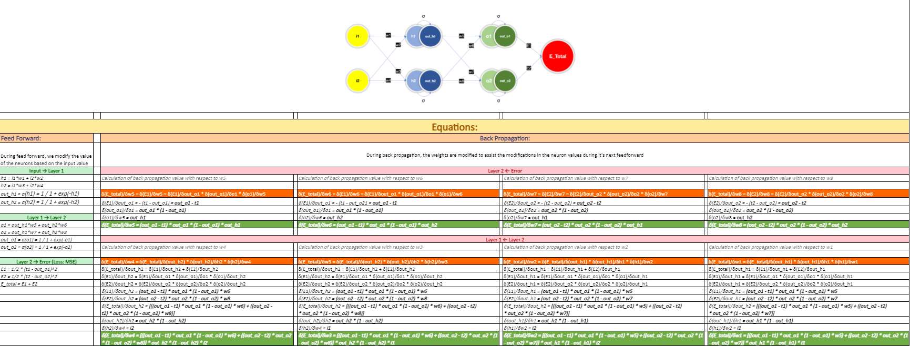
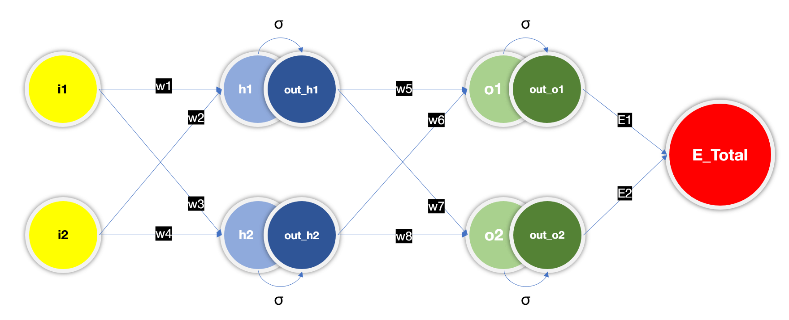
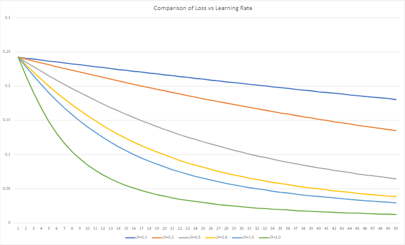
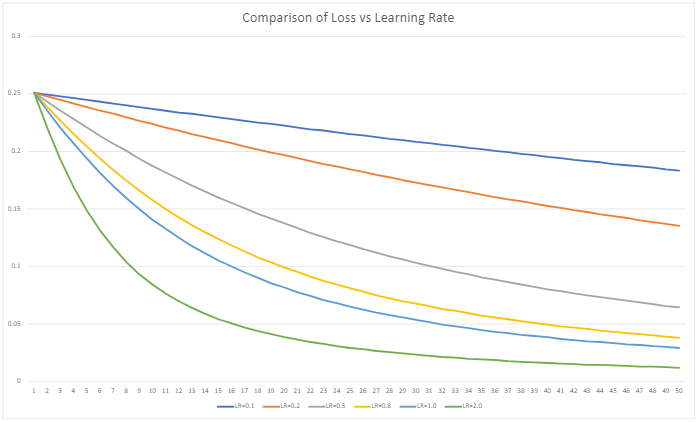

# Train a Neural Network using Excel

View the excel sheets online

1. [Excel sheet 1](https://docs.google.com/spreadsheets/d/13d23tbpe210Y8rhmIp6GADgnqzQfl3Tf/edit#gid=1351071457)
2. [Excel sheet 2](https://1drv.ms/x/s!AjN1NGjZ4GEZvB1E9xO0UZe8ssIV?e=q5cCkW)

## Image of the Equations based on a simple Neural Network

The image above show cases all the different equations that are generally used during a feed forward of a network and what happens during the back propagation to train a neural network. We used two different sets of values to understand how feed forward and back propagation works for the neural network. The image below shows the network architecture that we used to run a sample data training in the excel sheet.

## Steps

1. We have two inputs and two targets.
2. We start with 8 different weights values which are assigned to variables w1 to w8. The initial weights that are assigned are: [0.15, 0.2, 0.25, 0.3, 0.4, 0.45, 0.5, 0.55]
3. The output of the each neurons in the hidden layer and the output layer are calculated using the feed forward formulae.
4. Once the feed forward is performed, the error is calculated based on the obtained target values and the expected output.
5. Then back propagation is performed to understand by how much the weights should be updated based on what the error value was.
6. The initial weights are modified based on a learning rate value (which determines how large the modification of the weight value should be).
7. These steps are repeated for x (50) number of times hoping to achieve the desired output.
8. These steps are repeated with different learning rates - [0.1, 0.2, 0.5, 0.8, 1.0, 2.0]

Once the model is trained, the error graph looks like this:

Once these steps are completed, they are repeated for different set of weights - [0.3, 0.5, -0.2, 0.7, 0.1, -0.6, 0.3, -0.9]
The error graph for these new set of weights values are:

The iterations can be found the excel sheets linked above. The first excel sheet showcases the process that is followed with just the initial set of weights. You can observe the loss values in different tabs. Excel sheet 2 contains implementation for both weight values.
